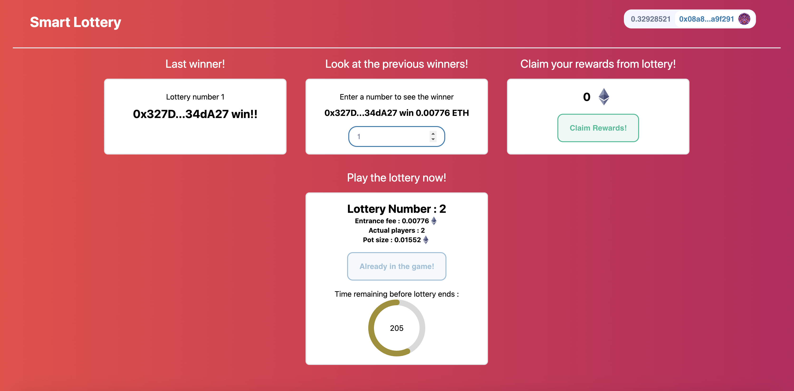
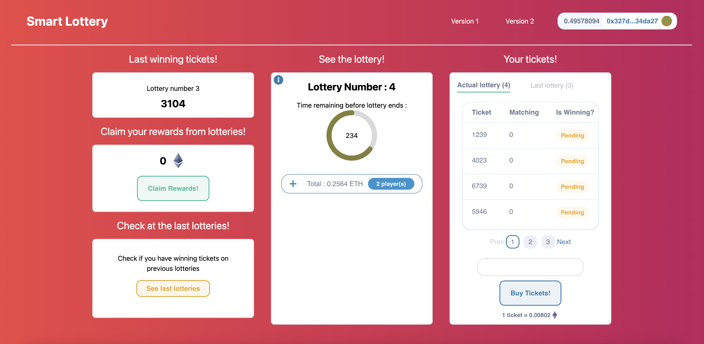

# Smart Lottery frontend

Version 1



Version 2



This is a repository to give a user interface on the Smart Lottery contracts.
This repository is the frontend repository of the [Smart Lottery contracts](https://github.com/jrchain/smart-lottery). However you absolutly can use this repository without the backend part.

[Full example of the App here!](https://white-wildflower-6380.on.fleek.co/)

## Summary

### Version 1

The Smart Lottery contract V1 creates a simple lottery which will picked a random winner once the lottery end.
The constructor takes an interval (time of duration of the lottery) and an usd entrance fee (entrance fee in dollars).

This contract implements :

- Chainlink Keeper to trigger when the lottery must end.
- Chainlink VRF to pick a random winner when the lottery ends.
- Chainlink price feed to know the entrance fee value in ETH.

The Smart Lottery V1 allow you to :

- `enterLottery`: Enter the lottery by paying entrance fees (USD convert to ETH).
- `claimRewards`: Get rewards of the previous lotteries you won.
- `getWinner`: Get any winner of a previous lottery thanks to the lottery number.
- `getLotteryBalance`: Get any pot size of a previous lottery thanks to the lottery number.

### Version 2

The Smart Lottery contract V2 creates a ticket lottery which will picked a random winning ticket once the lottery end.
The constructor takes an interval (time of duration of the lottery), an usd entrance fee (entrance fee in dollars) and a prize distribution corresponding on the percentage of each pots.

This contract implements :

- Chainlink Keeper to trigger when the lottery must end.
- Chainlink VRF to pick a random winner when the lottery ends.
- Chainlink price feed to know the ticket fee value in ETH.

The Smart Lottery V2 allow you to :

- `buyTickets`: Buy tickets to play the lottery by paying ticket fees (USD convert to ETH) - Max 10 tickets.
- `revealWinningTickets`: Reveal if you have winning tickets among all the tickets you buy.
- `claimRewards`: Get rewards of the previous lotteries where you get matching tickets.
- `getWinningTicket`: Get any winning tickets of a previous lottery thanks to the lottery number.
- `getLotteryBalance`: Get any pot size of a previous lottery thanks to the lottery number.

- [Smart Lottery](#smart-lottery)
  - [Summary](#summary)
    - [Version 1](#version-1)
    - [Version 2](#version-2)
  - [Prerequisites](#prerequisites)
  - [Installation](#installation)
  - [Testing](#testing)

## Prerequisites

Please install or have installed the following:

- [git](https://git-scm.com/book/en/v2/Getting-Started-Installing-Git)
- [nodejs](https://nodejs.org/en/download/)
- [yarn](https://yarnpkg.com/getting-started/install) instead of `npm`

## Installation

1. Clone this repository

```
git clone https://github.com/jrchain/smart-lottery-front-end
cd smart-lottery-front-end
```

2. Install dependencies and run the code

```
yarn
yarn dev
```

## Testing

The Application can be use locally thanks to hardhat node with the [backend repository](https://github.com/jrchain/smart-lottery). You need to add the hardhat network in your metamask and export an account.

You also can use goerli network. Be sure to connect with goerli network on your metamask.
